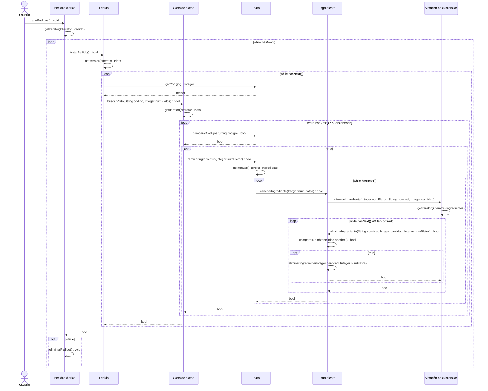

```mermaid
sequenceDiagram
actor U as Usuario

participant PD as Pedidos diarios
participant Pe as Pedido
participant C as Carta de platos
participant Pl as Plato
participant I as Ingrediente
participant A as Almacén de existencias

U->>PD: tratarPedidos() : void
PD->>PD: getIterator():Iterator~Pedido~
loop while hasNext()
  PD->>Pe: tratarPedido() : bool
  Pe->>Pe: getIterator():Iterator~Plato~
  loop while hasNext()
    Pe->>Pl: getCódigo() : Integer
    Pl-->>Pe: Integer
    Pe->>C: buscarPlato(String código, Integer numPlatos) : bool
    C->>C: getIterator():Iterator~Plato~
    loop while hasNext() && !encontrado
      C->>Pl: compararCódigos(String código) : bool
      Pl-->>C: bool
      opt true
        C->>Pl: eliminarIngredientes(Integer numPlatos) : bool
        Pl->>Pl: getIterator():Iterator~Ingrediente~
        loop while hasNext()
          Pl->>I: eliminarIngrediente(Integer numPlatos) : bool
          I->>A: eliminarIngrediente(Integer numPlatos, String nombreI, Integer cantidad)
          A->>A: getIterator():Iterator~Ingredientes~
          loop while hasNext() && !encontrado
            A->>I: eliminarIngrediente(String nombreI, Integer cantidad, Integer numPlatos) : bool
            I->>I: compararNombres(String nombreI) : bool
            opt true
              I->>I: eliminarIngrediente(Integer cantidad, Integer numPlatos)
              I-->>A: bool
            end
          A-->>I: bool
          end
        I-->>Pl: bool
        end
      Pl-->>C: bool
      end
    end
    C-->>Pe: bool
  end
  Pe-->>PD: bool
  opt = true
  PD->>PD: eliminarPedido() : void
  end
end
```
