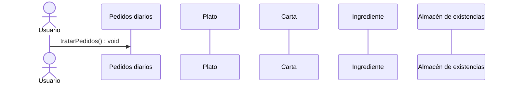

```mermaid
sequenceDiagram
actor U as Usuario
participant PD as Pedidos diarios
participant P as Pedido
participant C as Carta
participant P as Plato
participant I as Ingrediente
participant A as Almacén de existencias

U->>PD: tratarPedidos() : void

```
