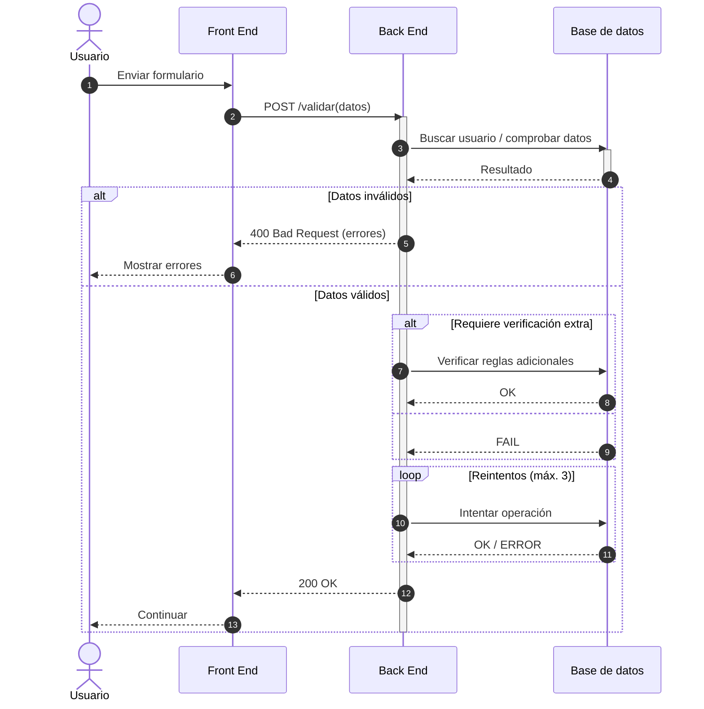

```mermaid
sequenceDiagram
    autonumber
    actor U as Usuario
    participant FE as Front End
    participant BE as Back End
    participant DB as Base de datos

    U->>FE: Enviar formulario
    FE->>BE: POST /validar(datos)
    activate BE
    BE->>DB: Buscar usuario / comprobar datos
    activate DB
    DB-->>BE: Resultado
    deactivate DB

    alt Datos inválidos
        BE-->>FE: 400 Bad Request (errores)
        FE-->>U: Mostrar errores
    else Datos válidos
        alt Requiere verificación extra
            BE->>DB: Verificar reglas adicionales
            DB-->>BE: OK
        else
            DB-->>BE: FAIL
        end

        loop Reintentos (máx. 3)
            BE->>DB: Intentar operación
            DB-->>BE: OK / ERROR
        end

        BE-->>FE: 200 OK
        FE-->>U: Continuar
    end
    deactivate BE
```
