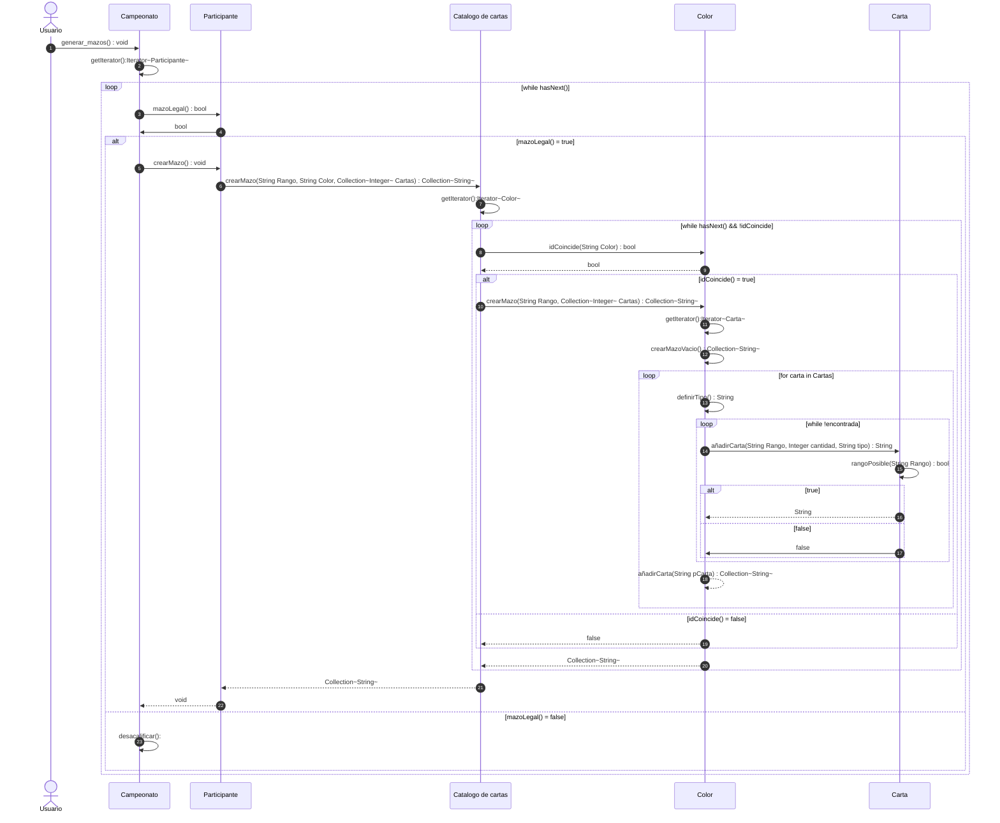

```mermaid
sequenceDiagram
autonumber
actor U as Usuario
participant C as Campeonato
participant P as Participante
participant Cat as Catalogo de cartas
participant Co as Color
participant Car as Carta

U->>C: generar_mazos() : void
C->>C: getIterator():Iterator~Participante~
loop while hasNext()
  C->>P: mazoLegal() : bool
  P->>C: bool
  alt mazoLegal() = true
    C->>P: crearMazo() : void
    P->>Cat: crearMazo(String Rango, String Color, Collection~Integer~ Cartas) : Collection~String~
    Cat->>Cat: getIterator():Iterator~Color~
    loop while hasNext() && !idCoincide
      Cat->>Co: idCoincide(String Color) : bool
      Co-->>Cat: bool
      alt idCoincide() = true
        Cat->>Co: crearMazo(String Rango, Collection~Integer~ Cartas) : Collection~String~
        Co->>Co: getIterator():Iterator~Carta~
        Co->>Co: crearMazoVacio() : Collection~String~
        loop for carta in Cartas
          Co->>Co: definirTipo() : String
          loop while !encontrada
            Co->>Car: añadirCarta(String Rango, Integer cantidad, String tipo) : String
            Car->>Car: rangoPosible(String Rango) : bool
            alt true
              Car-->>Co: String
            else false
              Car->>Co: false
            end
          end
          Co-->>Co: añadirCarta(String pCarta) : Collection~String~
        end
      else idCoincide() = false
      Co-->>Cat: false
      end
      Co-->>Cat: Collection~String~
    end
    Cat-->>P: Collection~String~
    P-->>C: void
  else mazoLegal() = false
    C->>C: desacalificar():
  end
end
```
