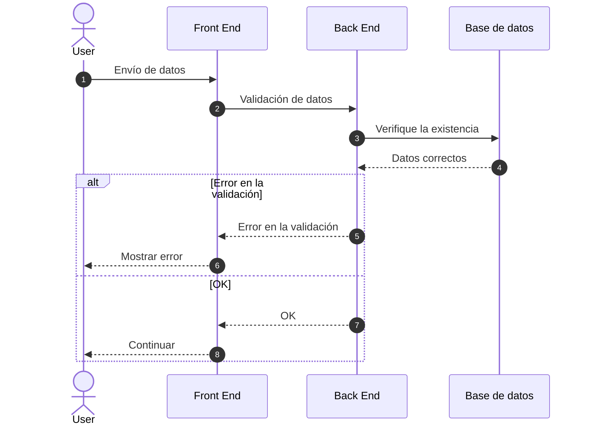

```mermaid
sequenceDiagram
    autonumber
    actor U as User
    participant FE as Front End
    participant BE as Back End
    participant DB as Base de datos

    U->>FE: Envío de datos
    FE->>BE: Validación de datos
    BE->>DB: Verifique la existencia
    DB-->>BE: Datos correctos

    alt Error en la validación
        BE-->>FE: Error en la validación
        FE-->>U: Mostrar error
    else OK
        BE-->>FE: OK
        FE-->>U: Continuar
    end

```
