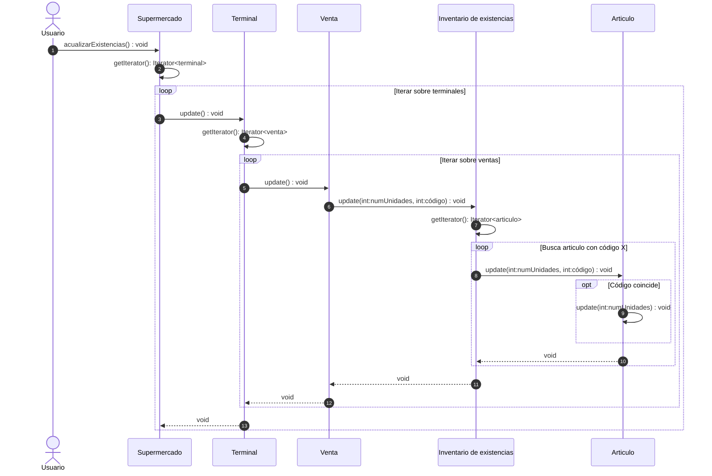

```mermaid
sequenceDiagram
  autonumber
  actor U as Usuario

  participant S as Supermercado
  participant T as Terminal
  participant V as Venta
  participant I as Inventario de existencias
  participant A as Articulo
  
  U->>S: acualizarExistencias() : void
  S->>S: getIterator(): Iterator<terminal>
  loop Iterar sobre terminales
    S->>T: update() : void
    T->>T: getIterator(): Iterator<venta>
    loop Iterar sobre ventas
      T->>V: update() : void
      V->>I: update(int:numUnidades, int:código) : void
      I->>I: getIterator(): Iterator<articulo>
      loop Busca articulo con código X
        I->>A: update(int:numUnidades, int:código) : void
        opt Código  coincide
          A->>A: update(int:numUnidades) : void
        end
        A-->>I: void
      end
      I-->>V: void
      V-->>T: void
    end
    T-->>S: void
  end

```
